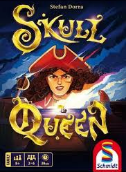

# SkullQueen

This is a school project for (equivalent) 5th year of highschool

This is a digital remake of the card game Skull Queen

It uses Windows Presentation Foundation in the C# language
the purpose of the project was to show that we understand OOP

it has 3 components:
 - A server that clients can connect to, this handles the game logic
 - A client that can connect to a server, this handles user input and UI
 - A shared class library that both server and client need

## some functionalities
 - Multiplayer
    - Usernames
    - Cat pictures
    - lobbies (using lobby codes)

 - Game
    - Setting up your plank
    - Playing tricks
    - Automatic scoring
    - Bots
    - Pirate King for 2 player games

### Notes
Because this is my first large project using WPF & events:
  - It does not implement good MVVM
  - The events can be a mess
  - The netcode can be better
  - It does not handle disconnects

## Documentation
[Class diagram](README/SkullQueenClassDiagram.png)
